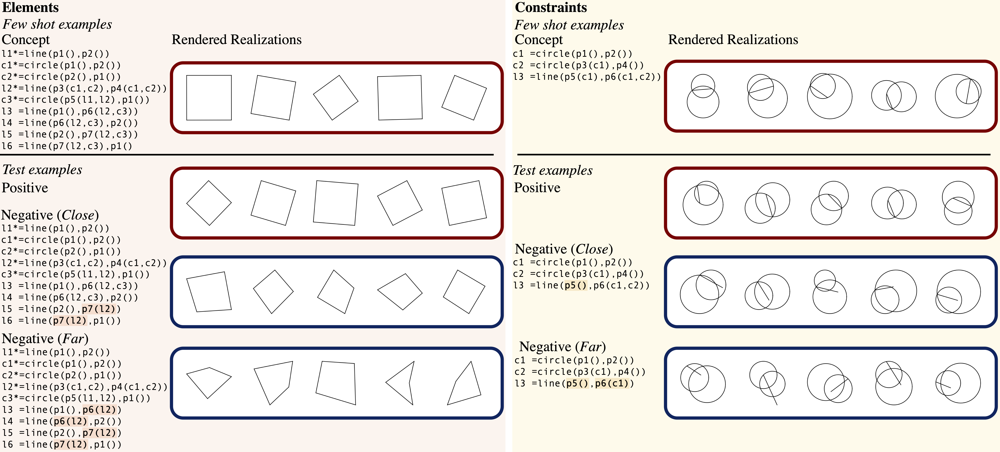

## Relational Match Task 

### 1. Generate Dataset
First, generate the relational match dataset:
```bash
python relational_match_task.py
```
This will create:
- `data_relational_match/train/` - Training images
- `data_relational_match/test/` - Test images
- `data_relational_match/train_labels.csv` - Initial labels

### 2. Prepare Final Dataset
Next, prepare the final dataset splits:
```bash
python prepare_final_dataset.py
```
This creates:
- `data_relational_match/train_labels_final.csv`
- `data_relational_match/test_labels_final.csv`

### 3. Train VGG Model
Train the VGG-based relational matching model:
```bash
python train_vgg_relational.py
```
The script includes:
- Early stopping based on validation loss
- Checkpoints saved to `checkpoints/vgg_relational/`
- Final metrics saved to `results/vgg_relational/`

## Dataset Structure

Each generated image contains:
- Standard panel (top-left)
- Match panel (bottom-left)
- Foil panel (bottom-right)

The task is to identify which bottom panel (Match or Foil) shares the same geometric relationship as the Standard panel.


# Geoclidean: Few-Shot Generalization in Euclidean Geometry



[Joy Hsu](https://web.stanford.edu/~joycj/), [Jiajun Wu](https://jiajunwu.com), [Noah Goodman](https://jiajunwu.com)

In NeurIPS Datasets and Benchmarks 2022

## Prerequisites
`pip install Shapely` and `pip install descartes`.

## Data
The Geoclidean-Elements and Geoclidean-Constraints dataset can be downloaded [here](https://downloads.cs.stanford.edu/viscam/Geoclidean/geoclidean.zip). Geoclidean-Elements includes 17 concepts and 34 tasks of Close and Far, while Geoclidean-Constraints includes 20 concepts and 40 tasks. The data is structured as following:
```
geoclidean    
│
└───elements -> the Geoclidean-Elements dataset
│   │
│   └───concept_name
│       │   concept.txt
│       │   close_concept.txt
│       │   far_concept.txt
│       │   train
│       │   │   1_fin.png -> rendered from concept.txt
│       │   │   2_fin.png
│       │   │   3_fin.png
│       │   │   4_fin.png
│       │   │   5_fin.png
│       │   test
│       │   │   in_1_fin.png -> rendered from concept.txt
│       │   │   in_2_fin.png
│       │   │   in_3_fin.png
│       │   │   in_4_fin.png
│       │   │   in_5_fin.png
│       │   │   out_close_1_fin.png -> rendered from close_concept.txt
│       │   │   out_close_2_fin.png
│       │   │   out_close_3_fin.png
│       │   │   out_close_4_fin.png
│       │   │   out_close_5_fin.png
│       │   │   out_far_1_fin.png -> rendered from far_concept.txt
│       │   │   out_far_2_fin.png
│       │   │   out_far_3_fin.png
│       │   │   out_far_4_fin.png
│       │   │   out_far_5_fin.png
│       ...
│   
└───constraints -> the Geoclidean-Constraints dataset
    │   ...

```


## Geoclidean DSL and Rendering
See examples of Euclidean geometry language to image rendering in `dataset_creation.ipynb`.


### Primitives:
- Point: `p1(), p1(object1), p1(object1, object2)` parameterized by constraints, which if indicated, are previously defined lines or circles that the current point must lie on
- Line: `line(p1(), p2())` parameterized by beginning and end points (points initialized inline, or can be reused and referred to by name if previously initialized)
- Circle: `circle(p1(), p2())` parameterized by center and edge points
    
### Syntax:
- Object statement: `l1 = line(p1(), p2())` (`l1` can be any name, and used as a constraint in future point initializations)
- Invisible object statement: `l1* = line(p1(), p2())` (`*` denotes helper objects not rendered)
- Concept: `[statement, statement, ...]`


## Model Benchmarking

### Feature extraction:
See feature extraction for VGG16, ResNet50, and IncepeptionV3 in `feature_extraction_cnn.ipynb`, and for Vision Transformer in `feature_extraction_vit.ipynb`.

### Benchmarking:
See accuracy and AUC calculation in `model_benchmarks.ipynb`.


